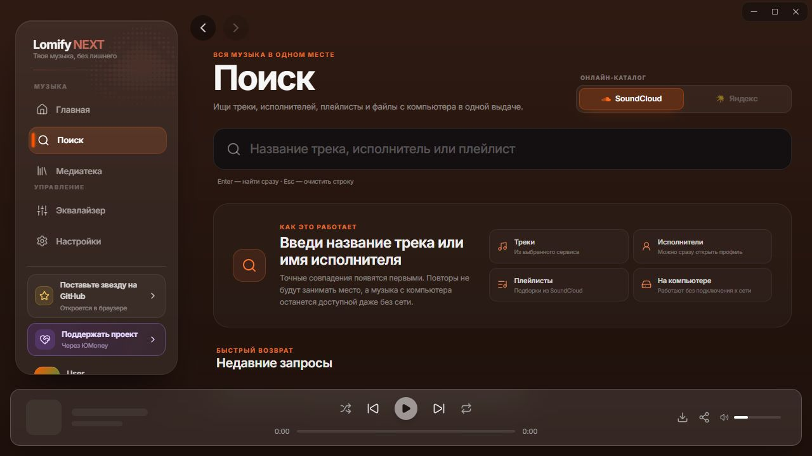

# LomifyNEXT

[](https://github.com/pizxxxxx/LomifyNEXT/releases)
[](LICENSE)

LomifyNEXT - музыкальный плеер для компьютера, который объединяет Яндекс Музыку, SoundCloud и твою медиатеку. Слушай любимые треки, открывай новую музыку и настраивай оформление и звук под себя.

[Скачать для Windows](https://github.com/pizxxxxx/LomifyNEXT/releases/latest) · [Версия для Android](https://github.com/pizxxxxx/LomifyNEXT-Mobile/releases/latest)



Экран поиска без подключенных аккаунтов. Доступны поиск по названию трека, исполнителя или плейлиста и выбор музыкального сервиса.

## Моя волна по треку

1. Для Яндекс Музыки подключи аккаунт в «Настройки» - «Сервисы». Волна SoundCloud доступна без аккаунта.
2. В медиатеке нажми кнопку «Моя волна по треку» рядом со скачиванием на карточке или в строке трека SoundCloud или Яндекса. Она также доступна внутри плейлиста и в нижнем плеере.
3. Откроется главная с подписью «Моя волна по треку: название». Новые треки добавляются в очередь автоматически.

Яндекс использует свою станцию и получает отметки о пропусках и дослушиваниях. Поток SoundCloud собирается в приложении: похожие треки догружаются по дослушанным песням, а два пропуска одного исполнителя исключают его из текущего сеанса. Обычная волна учитывает новые лайки и давность прослушиваний; старая история больше не доминирует только за счет большого числа повторов. Кнопка «Вернуться к обычной волне» на главной возвращает персональный поток.

## Что есть в приложении

Персональная волна по умолчанию ориентируется на свежие лайки за неделю и прослушивания
за две недели. Давние предпочтения и открытия дополняют очередь. При отсутствии новых
сигналов выбор расширяется. В настройке волны можно вернуть «Волну Яндекса» или обычную
волну SoundCloud. Лайки без известной даты не считаются свежими после импорта.

- Поиск треков по неполному названию и с опечатками, любимые треки и плейлисты из двух сервисов.
- Синхронизация названия, состава и порядка своих плейлистов Яндекс Музыки на телефоне и ПК через один аккаунт.
- Автоматическое обновление публичных плейлистов SoundCloud с сохранением местных правок в Lomify.
- Страницы исполнителей, релизы и персональные станции.
- Моя волна SoundCloud и Яндекс Музыки, в том числе от выбранного трека, с продолжением очереди.
- Скачивание треков и воспроизведение местных файлов.
- Полноэкранный плеер с обложкой, видеофоном и синхронным текстом песни.
- Очередь воспроизведения, эквалайзер и настройки звука.
- Темы оформления, выбор шрифтов и настройка интерфейса.
- Управление с клавиатуры и системные кнопки воспроизведения.
- История прослушиваний и подключение Last.fm.

Для Яндекс Музыки нужен подключённый аккаунт и действующая подписка. Доступность SoundCloud зависит от сети.

## Установка на Windows

1. Открой [последний релиз](https://github.com/pizxxxxx/LomifyNEXT/releases/latest), раскрой **Assets** и скачай файл `LomifyNEXT_<версия>_x64-setup.exe`.
2. Запусти установщик и следуй его шагам. После завершения открой LomifyNEXT через меню «Пуск» или ярлык.
3. Открой «Настройки» - «Сервисы», подключи нужные музыкальные сервисы и перейди в «Поиск».

Если SoundCloud не открывается, в настройках доступен встроенный подбор обхода. Windows может запросить права администратора. Статус и отчет о подборе показывают результат; отменить проверку можно в этом же разделе. Подобранный обход зависит от сети и не гарантирует доступ в любых условиях.

Версию приложения можно посмотреть в настройках. Перед сообщением об ошибке укажи ее номер, свои действия и текст ошибки, скрыв личные данные.

## Для разработки

Проект использует Tauri 2, Svelte 5, TypeScript и Rust. Навигация по исходникам, правила работы и проверки находятся в [карте проекта](docs/PROJECT_MAP.md).

```powershell
npm install
npm run tauri dev
```

Для Windows нужны Node.js, Rust и инструменты сборки C++ из Visual Studio. Проверка интерфейса: `npm run check`. Сборка интерфейса: `npm run build`. Проверка Rust: `npm run test:rust`. Создание установщика: `npm run tauri build` или `npm run build:exe`.

[Поддержать проект](https://yoomoney.ru/to/4100116984624656)

## Ссылки на музыку

Кнопка «Поделиться» создаёт HTTPS-ссылку: получатель открывает страницу и нажимает «Открыть в Lomify». На странице также есть переход к музыкальному сервису и скачивание приложения для Windows. Треки и подборки открываются без автозапуска.

Отдельная страница собирается командой `node scripts/build-share-page.mjs`. Для публикации через существующий GitHub Pages загрузите только `docs/share/` в ветку `main`; источник Pages - папка `/docs`. [Проверки и инструкции](docs/DAILY_MIXES.md).
